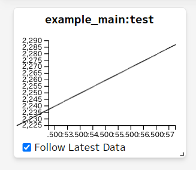
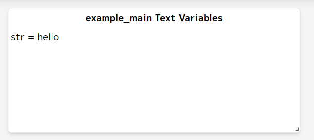
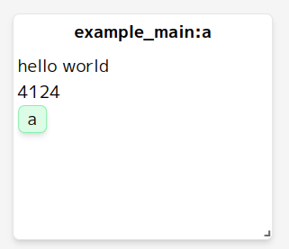
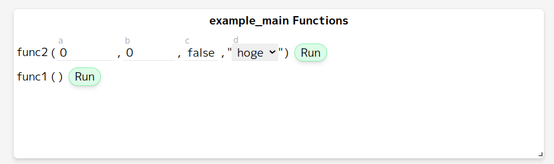
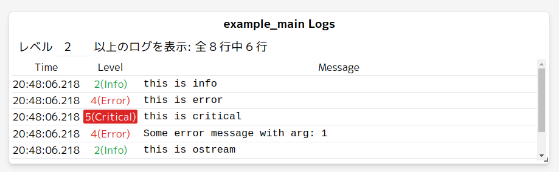

# WebCFace

[](https://github.com/na-trium-144/webcface/actions/workflows/cmake-coverage.yml)
[](https://github.com/na-trium-144/webcface/releases)

Web-based RPC &amp; UI Library

C++とJavaScriptで使える、WebSocketを使ったプロセス間通信ライブラリです。
データの送受信だけでなく、プロセス間での関数呼び出しができます。

また、WebブラウザーでアクセスできるUI(webcface-webui)から通信されているデータを確認したり関数を実行したりできる他、テキストやボタンなどを自由に配置してそのWebブラウザーに表示させることができます。

## Repository Links

* webcface: サーバー & C++クライアント
* [webcface-webui](https://github.com/na-trium-144/webcface-webui): webブラウザ用UIアプリ
* [webcface-js](https://github.com/na-trium-144/webcface-js): JavaScriptクライアント
* [webcface-tools](https://github.com/na-trium-144/webcface-tools): クライアントとなるコマンド群

## Features

### value
```cpp
WebCFace::Client wcli("example_main");
wcli.value("test") = 100;
wcli.sync();
```

```cpp
WebCFace::Client wcli("example_recv");
while(true){
	std::cout << "test = " << wcli.member("webcface_main").value("test") << std::endl;
	wcli.sync();
}
```
数値データはグラフとして表示され、スクロールして過去のデータを見ることもできます。



(画像とソースコード例は一致していません。これ以降の画像についても同様)

### text
```cpp
wcli.text("str") = "hello";
```

```cpp
while(true){
	std::cout << "str = " << wcli.member("webcface_main").text("str") << std::endl;
	wcli.sync();
}
```



### view
webブラウザ上にテキストやボタンを自由に配置できます。
```cpp
auto v = wcli.view("a");
v << "hello world" << std::endl;
v << WebCFace::button("a", [] { std::cout << "hello" << std::endl; });
```



### func
```cpp
wcli.func("func1") = []{ std::cout << "hello" << std::endl; };
```

```cpp
wcli.member("webcface_main").func("func1").run();
```



### log
[spdlog](https://github.com/gabime/spdlog)を使用しています。
```cpp
wcli.logger()->debug("this is debug");
wcli.logger()->info("this is info");
wcli.logger()->warn("this is warn");
```



## Installation

### Debian, Ubuntu (amd64, arm64, armhf)
[WebCFaceのReleases](https://github.com/na-trium-144/webcface/releases) と [webuiのReleases](https://github.com/na-trium-144/webcface-webui/releases) 、(オプショナルで: [toolsのReleases](https://github.com/na-trium-144/webcface-tools/releases)) からそれぞれ最新のdebパッケージをダウンロードしてインストールできます。

例 (amd64の場合)
```sh
curl -LO https://github.com/na-trium-144/webcface/releases/download/v1.1.0/webcface_1.1.0_amd64.deb
curl -LO https://github.com/na-trium-144/webcface-webui/releases/download/v1.0.4/webcface-webui_1.0.4_all.deb
curl -LO https://github.com/na-trium-144/webcface-tools/releases/download/v1.0.0/webcface-tools_1.0.0_amd64.deb
sudo apt install ./webcface*.deb
```

(webcface-toolsの内容と使い方についてはwebcface-toolsのReadmeを参照してください)

### Homebrew (MacOS, Linux)
```sh
brew tap na-trium-144/webcface
brew install webcface webcface-webui
```

### Build from source

* c++20に対応したコンパイラが必要です
* テスト済みの環境
	* Windows
		* MSVC: ok
		* MinGW Clang17
			* 終了時にSegmentation Faultするバグがありますが動作はします ([#43](https://github.com/na-trium-144/webcface/issues/43))
		* MinGW GCC13: NG (リンクエラー)
			* GCC12では動くっぽい?
	* Linux
		* GCC, Clang: ok
	* MacOS
		* Clang: ok

```sh
git submodule update --init --recursive
cmake -Bbuild
cmake --build build
sudo cmake --build build -t install
```
* その後、[webuiのReleases](https://github.com/na-trium-144/webcface-webui/releases) からビルド済みのtar.gzのアーカイブをダウンロードして webui/dist/ (installして使う場合は /path/to/prefix/share/webcface/dist) として展開してください
* webcfaceは外部ライブラリとして [cinatra](https://github.com/qicosmos/cinatra), [eventpp](https://github.com/wqking/eventpp), [msgpack-cxx](https://github.com/msgpack/msgpack-c), [spdlog](https://github.com/gabime/spdlog), [tclap](https://tclap.sourceforge.net) を使用します。
	* システムにインストールされてなければsubmoduleにあるソースコードをビルドしますが、eventpp, msgpack, spdlog に関してはインストールされていればそれを使用するのでビルドが速くなります
	* ubuntuなら `sudo apt install libspdlog-dev`, brewなら `brew install spdlog msgpack-cxx` でインストールできます
* `-DWEBCFACE_EXAMPLE=on`でexampleを、`-DWEBCFACE_TEST=on`でtestをビルドします。

## Usage

### Server
WebCFaceを使用するときはserverを常時立ち上げておく必要があります

```sh
webcface-server
```
でサーバーを起動します

起動時に表示されるurl (http://pcのipアドレス:7530/) をブラウザから開くとwebuiにアクセスすることができます

### Client (C++)

```cmake
find_package(webcface)
target_link_libraries(target PRIVATE webcface::webcface)
```

```cpp
#include <webcface/webcface.h>

WebCFace::Client wcli("name of this client program");
```

## Documentation

* Clientライブラリの使い方は[こちら](https://na-trium-144.github.io/webcface/md_01__client.html)を参照してください。
* [example/](./example/) 以下にサンプルコードがあるのでそちらも参照してください
